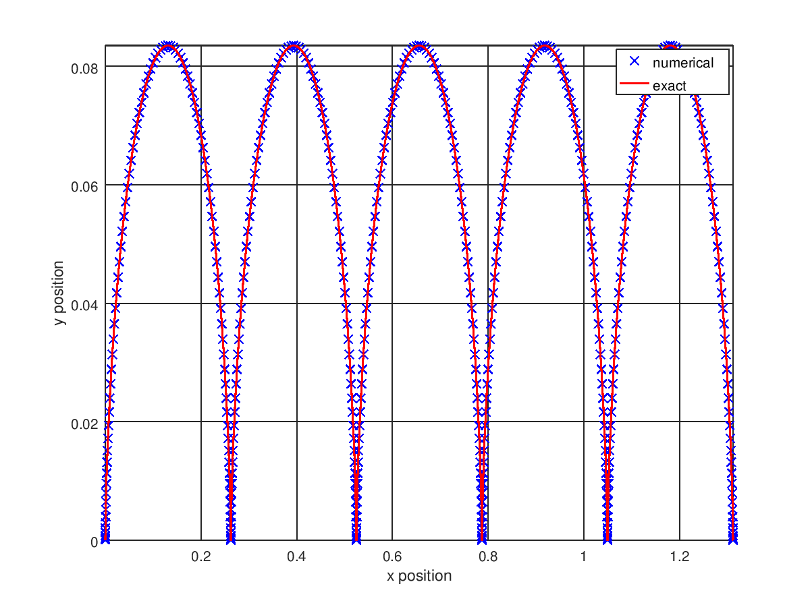
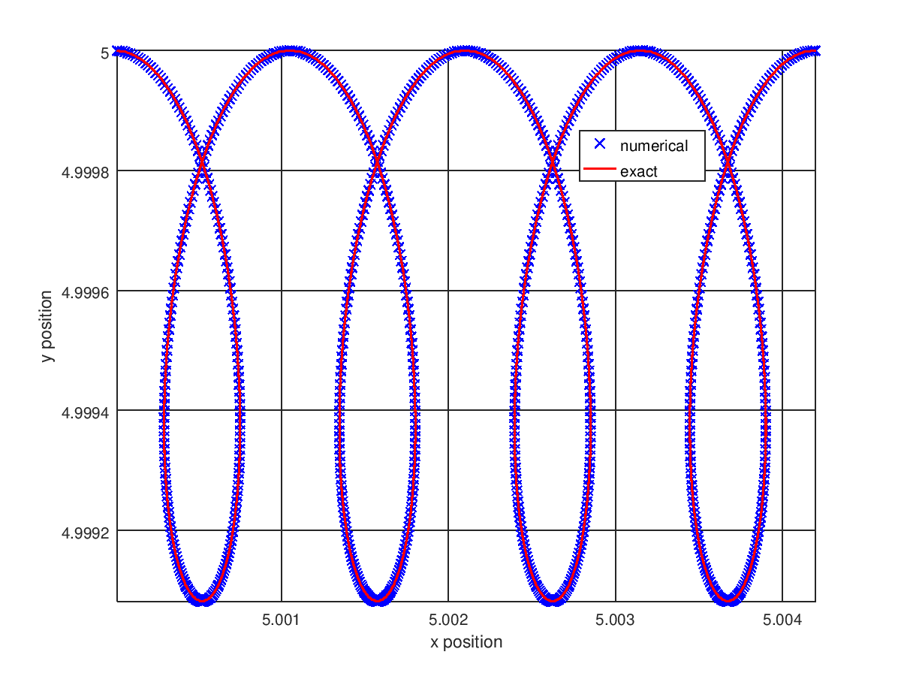

## Dependencies
This is intended to be run in Unix based operating system.
`BLAS` is required to run this program. `GCC` is needed to compile
Use the following commands to install it in Debian based systems.
```bash
sudo apt install libopenblas-dev gcc
```

You can use GNU Octave to generate graphs

```bash
sudo apt install octave
```

## How to use

1. To compile, run `make`
2. Run `./motion_of_charge.exe [parameters]` (See examples)

By default it will save values to `output.dat`, whose columns are `time`, `numerical x`, `numerical y`, `exact x`, `exact y`.
The parameters are, values of (in S.I. units) the following quantities in the following order `Magnetic Field along z axis`, `Electric field along y axis`, `x(0)`, `y(0)`, `v_x(0)`, `v_y(0)`, `no of iterations`, `no of turns`, `charge`, `mass`.

If no option is given, the following default values are taken: 

- `Magnetic Field along z axis` = 0.002 (Tesla),
- `Electric field along y axis` = 40 (Volt/meter),
- `x(0)` = 0,
- `y(0)` = 0,
- `v_x(0)` = 0,
- `v_y(0)` = 0,
- `no of iterations` = 1000,
- `no of turns` = 3,
- `charge` = charge of proton,
- `mass` = mass of proton

3. You can open output.dat in any data plotting program. To see it in Octave, run `octave-cli -q`
4. To generate the graph, run `showMotion('output.dat')` within Octave.

## Examples

### Example 1
`./motion_of_charge.exe 0.005 100 0 0 0 0 500 5` will correspond to 
- `Magnetic Field along z axis` = 0.005 Tesla,
- `Electric field along y axis` = 100 Volt/meter,
- `x(0)` = 0,
- `y(0)` = 0,
- `v_x(0)` = 0,
- `v_y(0)` = 0,
- `no of iterations` = 500,
- `no of turns` = 5,
- `charge` = charge of proton, (unaltered since no value is given, of course it can be changed)
- `mass` = mass of proton (unaltered since no value is given)

Now run Octave (as described in How to run section) to see the graphs.
This gives rise to a cycloidal motion.


### Example 2
For example, `./motion_of_charge.exe 0.05 100 1 2 1e4 5e3 1500 4` will correspond to 
- `Magnetic Field along z axis` = 0.05 Tesla,
- `Electric field along y axis` = 100 Volt/meter,
- `x(0)` = 1 meter,
- `y(0)` = 2 meter,
- `v_y(0)` = 2000 m/s,
- `no of iterations` = 1500,
- `no of turns` = 4,
- `charge` = charge of proton, (unaltered since no value is given, of course it can be changed)
- `mass` = mass of proton (unaltered since no value is given)

The motion will consist of loops.
